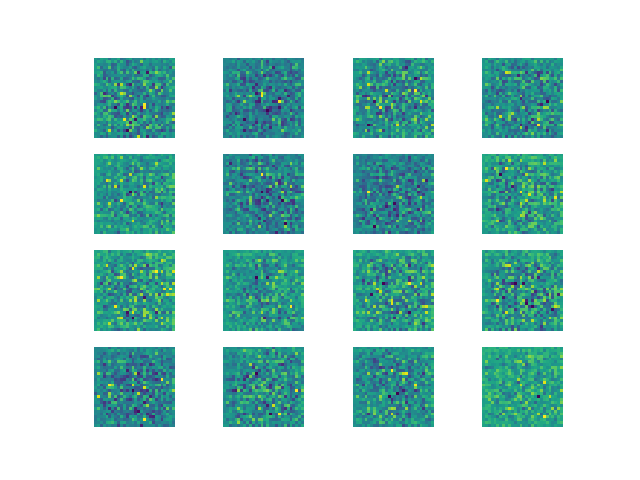
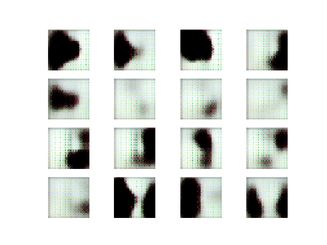
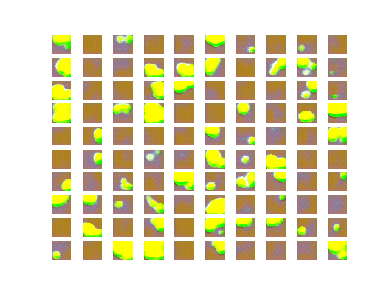
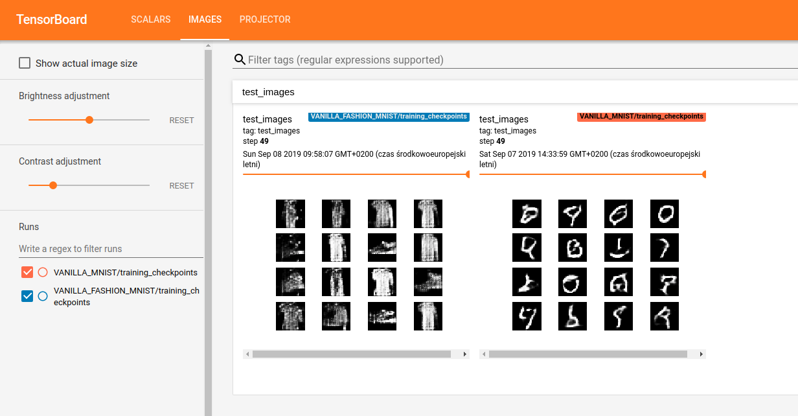

   [](https://travis-ci.com/tlatkowski/gans-2.0)

# GANs 2.0: Generative Adversarial Networks in TensorFlow 2.0

## Project aim

The main aim of this project is to speed up the process of building 
deep learning pipelines that are based on Generative Adversarial Networks 
and simplify the prototyping of various generator/discriminator models. 
This library provides several GAN trainers that can be used 
as off-the-shelf features such us: 
* Vanilla GAN
* Conditional GAN
* Cycle GAN

## Examples
Vanilla GAN (MNIST)            |  Conditional GAN (MNIST)
:-------------------------:|:-------------------------:
  |  


Vanilla GAN (FASHION_MNIST)            |  Conditional GAN (FASHION_MNIST)
:-------------------------:|:-------------------------:
  |  


Vanilla GAN (CIFAR10)            |  Conditional GAN (CIFAR10)
:-------------------------:|:-------------------------:
  |  

Cycle GAN (SUMMER2WINTER)            |  Cycle GAN (WINTER2SUMMER)
:-------------------------:|:-------------------------:
  |  

## Installation

In order to install all required dependencies, execute the following command:

in case of **CPU** usage:
```bash
./bin/install-cpu.sh
```
in case of **GPU** usage:
```bash
./bin/install-gpu.sh
```

The current version of pipeline supports the following datasets:
 * MNIST
 * FASHION MNIST
 * CIFAR10
 * SUMMER2WINTER
 
The set of supported Generative Adversarial Networks:
 * Vanilla GAN
 * Conditional GAN
 * Cycle GAN
 * Wasserstein GAN (TBD)

## Running pipeline

#### Model training from scratch
In order to run GAN training on a specific problem you have to provide one mandatory parameter:
 * **--problem_type**
 
The below command runs Vanilla GAN on MNIST dataset:
```bash
python run.py --problem_type VANILLA_MNIST
```

#### Restoring model training

In order to restore training from the latest checkpoint use **-continue_training** input argument, e.g.
```bash
python run.py --problem_type VANILLA_MNIST -continue_training
```
#### GAN problem configuration

The GAN problem configurations are placed at **./config**. If you want you can tweak those parameters, below is the example of VANILLA_MNIST problem configuration:
```yml
batch_size: 256
buffer_size: 60000
num_epochs: 100
hidden_size: 100
img_height: 28
img_width: 28
num_channels: 1
checkpoint_step: 10
learning_rate_generator: 0.0002
learning_rate_discriminator: 0.0002
save_images_every_n_steps: 100
```
 
## Monitoring model training
In order to visualize a training process (loss values, generated outputs) run the following command in the project directory:
```bash
tensorboard --logdir outputs
```
To follow the training process go to the default browser and type the following address **http://your-workstation-name:6006/** 

The below picture presents the TensorBoard view lunched for two experiments: **VANILLA_MNIST** and **VANILLA_FASION_MNIST**.
 
## References
1. [Deep Convolutional Generative Adversarial Network Tutorial in TensorFlow](https://www.tensorflow.org/beta/tutorials/generative/dcgan)
2. [Cycle GAN Tutorial in TensorFlow](https://www.tensorflow.org/tutorials/generative/cyclegan)
3. [Unpaired Image-to-Image Translation using Cycle-Consistent Adversarial Networks paper](https://arxiv.org/pdf/1703.10593.pdf)
